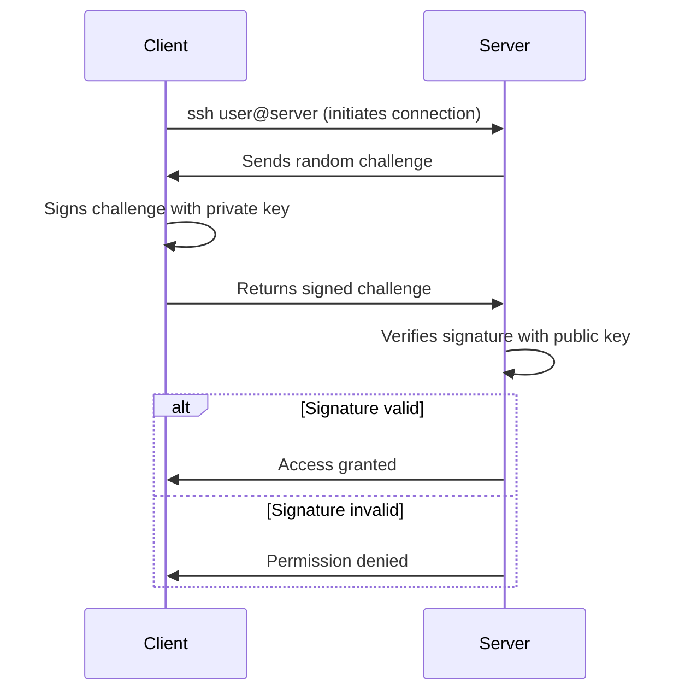

# Diagrams

This directory contains visual diagrams for the SSH key authentication guide.

## Recommended Diagrams to Include

### 1. `ssh-auth-flow.png` — SSH Key Authentication Handshake

A diagram showing the 5-step handshake between client and server:
1. Client initiates connection: `ssh user@server`
2. Server sends a cryptographic challenge (random data)
3. Client signs the challenge with its private key
4. Server verifies the signature using the public key in `authorized_keys`
5. Authentication succeeded or denied

**Tools to create this:**
- [Excalidraw](https://excalidraw.com/) — free, produces clean diagrams
- [diagrams.net (draw.io)](https://app.diagrams.net/) — free, feature-rich
- [Mermaid](https://mermaid.live/) — text-based, embeddable in markdown

**Mermaid source for the handshake diagram:**

### 2. `key-architecture.png` — Private vs Public Key Architecture

A diagram showing:
- The private key stays on the client machine (laptop/desktop)
- The public key is deployed to multiple servers
- Arrows showing "never leaves machine" vs "safe to distribute"

### 3. `team-setup.png` — Multi-User SSH Key Architecture

A diagram showing:
- Multiple team members, each with their own keypair
- Each public key added to respective `authorized_keys` files on servers
- Individual user accounts vs shared accounts

---

## Notes

- Keep diagrams in PNG or SVG format (SVG preferred for scaling)
- Use color consistently: red for private/secure elements, green for public/shareable elements
- Keep text large enough to read when embedded in the README
- Include source files (`.excalidraw`, `.drawio`, `.mmd`) for future editing